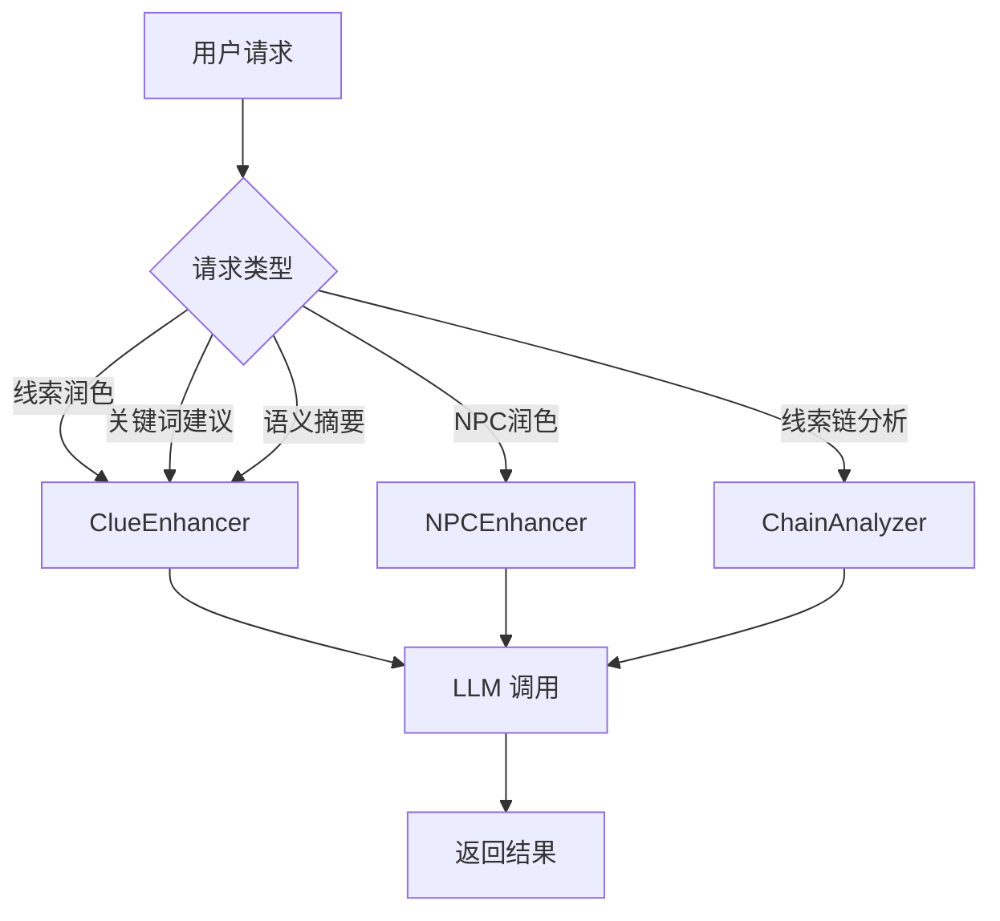
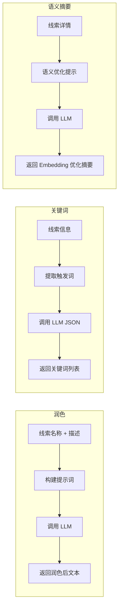
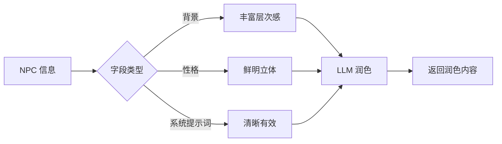
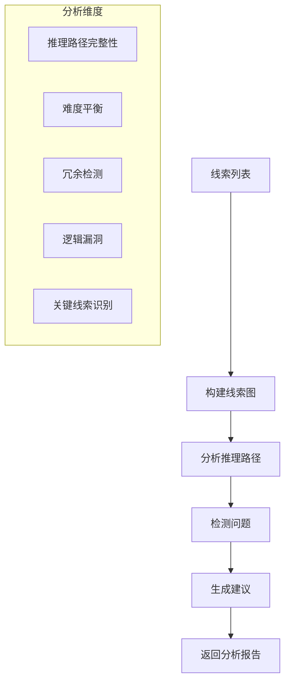

# AI Enhancement Service (AI 内容增强服务)

## 概述

AI 内容增强服务提供 AI 驱动的内容润色和优化能力，包括线索增强、NPC 描述增强和线索链分析。

## 目录结构

```
enhancement/
├── __init__.py          # 模块入口
├── README.md            # 本文档
├── service.py           # 主服务类 (编排层)
├── llm_base.py          # LLM 调用基类
├── clue_enhancer.py     # 线索增强器
├── npc_enhancer.py      # NPC 增强器
└── chain_analyzer.py    # 线索链分析器
```

## 核心流程图



## 各模块详解

### 1. 线索增强器 (ClueEnhancer)



**功能：**
- `polish_detail`: 润色线索描述，使其更生动有画面感
- `polish_detail_stream`: 流式润色
- `suggest_trigger_keywords`: 生成 5-10 个触发关键词
- `generate_semantic_summary`: 生成 Embedding 匹配优化的语义摘要
- `generate_semantic_summary_stream`: 流式生成语义摘要

### 2. NPC 增强器 (NPCEnhancer)



**功能：**
- `polish_description`: 根据字段类型润色 NPC 描述
- `polish_description_stream`: 流式润色

**支持字段：**
- `background`: 背景故事
- `personality`: 性格描述
- `system_prompt`: 系统提示词

### 3. 线索链分析器 (ChainAnalyzer)



**输出格式：**
```json
{
  "overall_score": 8,
  "summary": "整体评价摘要",
  "issues": [
    {"type": "逻辑漏洞", "severity": "high", "description": "...", "affected_clues": ["clue_001"]}
  ],
  "suggestions": [
    {"type": "添加线索", "description": "...", "priority": "high"}
  ],
  "key_clues": ["clue_001", "clue_005"],
  "reasoning_paths": ["路径1描述", "路径2描述"]
}
```

## 使用方法

```python
from app.services.enhancement import AIEnhancementService

# 创建服务
service = AIEnhancementService(db)

# 1. 润色线索
polished = await service.polish_clue_detail(
    clue_name="血迹",
    clue_detail="地上有血迹",
    context="故事发生在古堡",
)

# 2. 生成触发关键词
keywords = await service.suggest_trigger_keywords(
    clue_name="血迹",
    clue_detail="地上有一滩暗红色的血迹...",
)

# 3. 生成语义摘要
summary = await service.generate_semantic_summary(
    clue_name="血迹",
    clue_detail="地上有一滩暗红色的血迹...",
)

# 4. 润色 NPC 描述
polished_bg = await service.polish_npc_description(
    npc_name="管家",
    field="background",
    content="管家在这里工作了20年",
)

# 5. 分析线索链
analysis = await service.analyze_clue_chain(
    clues=[
        {"id": "clue_001", "name": "血迹", "detail": "...", "prereq_clue_ids": []},
        {"id": "clue_002", "name": "凶器", "detail": "...", "prereq_clue_ids": ["clue_001"]},
    ],
    script_background="这是一个发生在古堡的谋杀案...",
)
```

## 流式 API

所有带 `_stream` 后缀的方法返回 `AsyncGenerator[str, None]`，适合流式输出：

```python
async for chunk in service.polish_clue_detail_stream(clue_name, clue_detail):
    print(chunk, end="", flush=True)
```

## 配置参数

| 参数 | 说明 | 默认值 |
|------|------|--------|
| `llm_config_id` | LLM 配置 ID | 使用默认 CHAT 配置 |
| `context` | 故事背景上下文 | 可选 |
