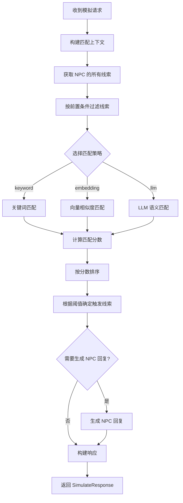
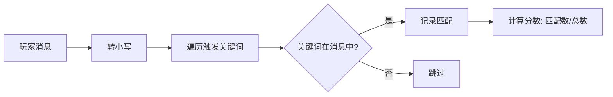
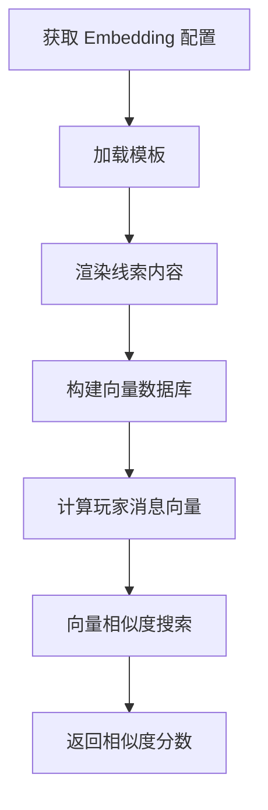
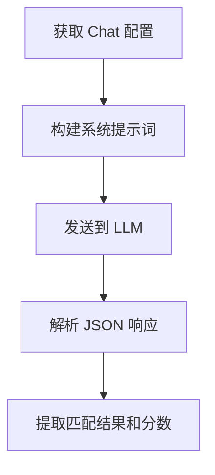
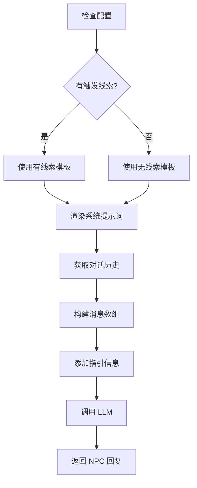

# 线索匹配服务 (Clue Matching Service)

## 概述

线索匹配服务负责在对话模拟中将玩家消息与线索进行匹配。支持三种匹配策略：关键词匹配、向量相似度匹配和 LLM 语义匹配。

## 目录结构

```
matching/
├── __init__.py           # 模块入口，导出主要类
├── README.md             # 本文档
├── models.py             # 数据模型定义
├── service.py            # 主服务类 (MatchingService)
├── npc_response.py       # NPC 响应生成器
└── strategies/           # 匹配策略
    ├── __init__.py
    ├── base.py           # 策略基类
    ├── keyword.py        # 关键词匹配策略
    ├── embedding.py      # 向量匹配策略
    └── llm.py            # LLM 匹配策略
```

## 核心流程图



## 匹配策略详解

### 1. 关键词匹配 (KeywordStrategy)



**特点：**
- 简单快速
- 精确匹配
- 适合关键词明确的场景

### 2. 向量相似度匹配 (EmbeddingStrategy)



**特点：**
- 语义级别匹配
- 支持模板渲染
- 需要 Embedding 模型

### 3. LLM 语义匹配 (LLMStrategy)



**特点：**
- 最智能的匹配方式
- 支持复杂语义理解
- 可自定义匹配策略模板
- 只选择最佳匹配（避免重复触发）

## NPC 响应生成流程



## 使用方法

```python
from app.services.matching import MatchingService
from app.schemas.simulate import SimulateRequest, MatchingStrategy

# 创建服务
service = MatchingService(db)

# 构建请求
request = SimulateRequest(
    player_message="我想知道关于血迹的事情",
    script_id="script_001",
    npc_id="npc_001",
    unlocked_clue_ids=["clue_001"],
    matching_strategy=MatchingStrategy.LLM,
    llm_config_id="config_001",
)

# 执行模拟
response = await service.simulate(request)

# 获取结果
print(response.matched_clues)
print(response.triggered_clues)
print(response.npc_response)
```

## 数据模型

| 类名 | 说明 |
|------|------|
| `MatchContext` | 匹配上下文，包含玩家消息、配置等 |
| `MatchResult` | 单个线索的匹配结果 |
| `NpcResponseResult` | NPC 响应结果，包含提示词信息 |
| `LLMMatchPrompts` | LLM 匹配的提示词（用于调试） |
| `LLMMatchResponse` | LLM 返回的匹配响应结构 |

## 配置参数

| 参数 | 说明 | 默认值 |
|------|------|--------|
| `matching_strategy` | 匹配策略 | `keyword` |
| `llm_config_id` | LLM 配置 ID | 使用默认配置 |
| `template_id` | 匹配模板 ID | 无 |
| `embedding_options_override.similarity_threshold` | 向量相似度阈值 | 0.5 |
| `chat_options_override.score_threshold` | LLM 分数阈值 | 0.5 |
| `llm_return_all_scores` | 是否返回所有线索的分数 | `false` |
