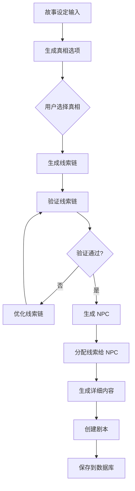
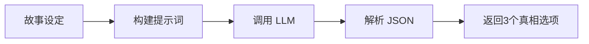
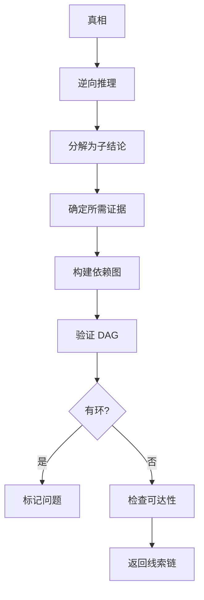
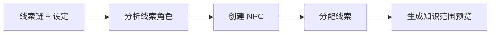
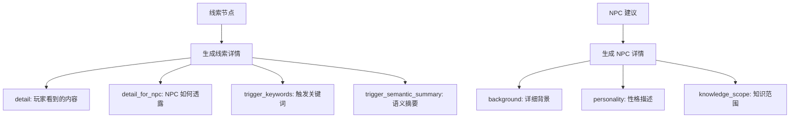
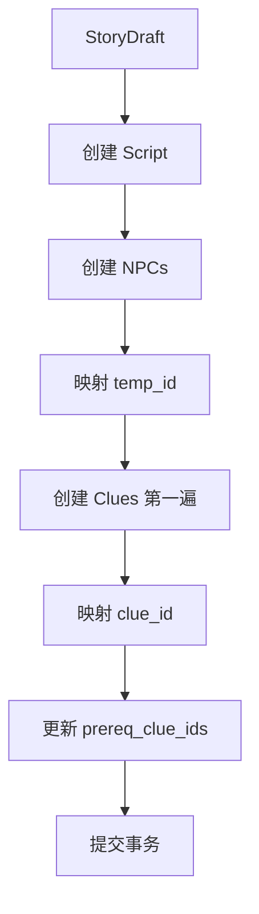

# AI 故事助手服务 (AI Story Assistant Service)

## 概述

AI 故事助手服务提供 AI 驱动的剧本杀故事创作能力，包括真相生成、线索链设计、NPC 生成和细节填充。

## 目录结构

```
story_assistant/
├── __init__.py              # 模块入口
├── README.md                # 本文档
├── service.py               # 主服务类 (编排层)
├── llm_base.py              # LLM 调用基类
├── truth_generator.py       # 真相生成器
├── clue_chain_generator.py  # 线索链生成器 (含验证)
├── npc_generator.py         # NPC 生成器
├── detail_generator.py      # 细节生成器
└── script_builder.py        # 剧本构建器
```

## 核心流程图



## 各模块详解

### 1. 真相生成器 (TruthGenerator)



**输入：** 故事设定（类型、时代、地点、氛围）+ 可选提示
**输出：** 3个真相选项，包含凶手、动机、手法、反转

### 2. 线索链生成器 (ClueChainGenerator)



**核心算法：**
- 逆向推理：从真相倒推到根线索
- DAG 验证：使用 DFS 检测环
- 可达性检查：BFS 验证所有线索可达

**验证规则：**
- 根线索数量：3-8 个
- 无循环依赖
- 所有线索可达
- 关键结论有多条路径

### 3. NPC 生成器 (NPCGenerator)



**分配原则：**
- 每个 NPC 2-5 条线索
- 相关线索分配给同一 NPC
- 关键线索分散到多个 NPC
- 背景需能解释为何拥有线索

### 4. 细节生成器 (DetailGenerator)



### 5. 剧本构建器 (ScriptBuilder)



## 使用方法

```python
from app.services.story_assistant import AIStoryAssistantService
from app.schemas.ai_assistant import (
    GenerateTruthRequest,
    GenerateClueChainRequest,
    GenerateNPCsRequest,
    GenerateDetailsRequest,
    StorySettingInput,
    SelectedTruth,
)

# 创建服务
service = AIStoryAssistantService(db)

# 1. 生成真相选项
truth_request = GenerateTruthRequest(
    setting=StorySettingInput(
        genre=Genre.SUSPENSE,
        era="1920s",
        location="豪华邮轮",
        npc_count=5,
    )
)
truth_options = await service.generate_truth_options(truth_request)

# 2. 用户选择真相后，生成线索链
clue_chain_request = GenerateClueChainRequest(
    setting=story_setting,
    truth=selected_truth,
)
clue_chain = await service.generate_clue_chain(clue_chain_request)

# 3. 如果验证失败，优化线索链
if not clue_chain.validation.is_valid:
    clue_chain = await service.optimize_clue_chain(clue_chain)

# 4. 生成 NPC
npc_request = GenerateNPCsRequest(
    setting=story_setting,
    truth=selected_truth,
    clue_chain=clue_chain,
    npc_count=5,
)
npcs = await service.generate_npcs(npc_request)

# 5. 生成详细内容
detail_request = GenerateDetailsRequest(
    setting=story_setting,
    truth=selected_truth,
    clue_chain=clue_chain,
    npcs=npcs.npcs,
)
details = await service.generate_details(detail_request)

# 6. 创建剧本
draft = StoryDraft(...)
script = await service.create_script_from_draft(draft)
```

## 数据流转

```
StorySettingInput
       ↓
TruthOptionsResponse → SelectedTruth
       ↓
ClueChainSuggestion (with validation)
       ↓
NPCAssignmentResponse
       ↓
DetailFillResponse
       ↓
StoryDraft → Script (in DB)
```

## 配置参数

| 参数 | 说明 | 默认值 |
|------|------|--------|
| `llm_config_id` | LLM 配置 ID | 使用默认 CHAT 配置 |
| `temperature` | LLM 温度 | 0.7 |
| `npc_count` | NPC 数量 | 由用户指定 |
