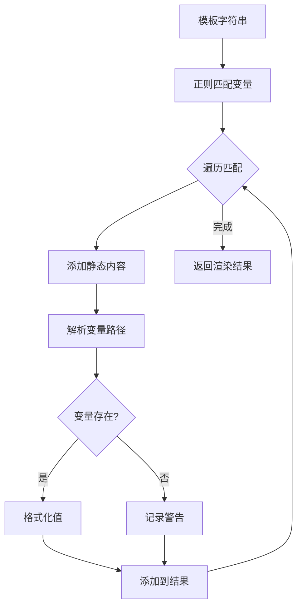

# Template Rendering Service (模板渲染服务)

## 概述

模板渲染服务提供提示词模板的变量替换和格式化能力，支持 jsonpath 风格的嵌套字段访问。

## 目录结构

```
template/
├── __init__.py      # 模块入口
├── README.md        # 本文档
├── renderer.py      # 主渲染器类
├── variables.py     # 变量定义
└── formatters.py    # 格式化工具
```

## 核心流程图



## 模板语法

### 基本语法

```
{{variable}}           # 简单变量
{{object.field}}       # 对象字段
{{object.nested.field}} # 嵌套字段
{{list_var|format}}    # 列表格式化
```

### 列表格式化选项

| 格式 | 语法 | 输出示例 |
|------|------|----------|
| 编号列表 (默认) | `{{var}}` 或 `{{var\|list}}` | `1. item1\n2. item2` |
| 逗号分隔 | `{{var\|comma}}` | `item1, item2` |
| 圆点列表 | `{{var\|bullet}}` | `• item1\n• item2` |
| 破折号列表 | `{{var\|dash}}` | `- item1\n- item2` |
| 换行分隔 | `{{var\|newline}}` | `item1\nitem2` |

## 可用变量

### clue (线索)

| 变量 | 类型 | 说明 |
|------|------|------|
| `clue.id` | string | 线索 ID |
| `clue.name` | string | 线索名称 |
| `clue.type` | string | 线索类型 (text/image) |
| `clue.detail` | string | 线索详情 |
| `clue.detail_for_npc` | string | NPC 透露指导 |
| `clue.trigger_keywords` | list | 触发关键词 |
| `clue.trigger_semantic_summary` | string | 语义摘要 |

### npc (NPC)

| 变量 | 类型 | 说明 |
|------|------|------|
| `npc.id` | string | NPC ID |
| `npc.name` | string | NPC 名称 |
| `npc.age` | number | NPC 年龄 |
| `npc.background` | string | 背景故事 |
| `npc.personality` | string | 性格描述 |
| `npc.knowledge_scope.knows` | list | NPC 知道的事 |
| `npc.knowledge_scope.does_not_know` | list | NPC 不知道的事 |
| `npc.knowledge_scope.world_model_limits` | list | 世界观限制 |

### script (剧本)

| 变量 | 类型 | 说明 |
|------|------|------|
| `script.id` | string | 剧本 ID |
| `script.title` | string | 剧本标题 |
| `script.summary` | string | 剧本摘要 |
| `script.background` | string | 背景设定 |
| `script.difficulty` | string | 难度等级 |
| `script.truth.murderer` | string | 凶手 |
| `script.truth.weapon` | string | 凶器 |
| `script.truth.motive` | string | 动机 |
| `script.truth.crime_method` | string | 作案手法 |

### context (上下文)

| 变量 | 类型 | 说明 |
|------|------|------|
| `player_input` | string | 玩家输入 |
| `now` | string | 当前时间戳 |
| `unlocked_clues` | list | 已解锁线索列表 |

## 使用方法

```python
from app.services.template import template_renderer

# 基本渲染
template = "{{npc.name}} says: {{clue.detail}}"
context = {
    "npc": {"name": "John", "age": 30},
    "clue": {"name": "Evidence", "detail": "A bloody knife"}
}
result = template_renderer.render(template, context)
# result.content = "John says: A bloody knife"

# 列表格式化
template = "Keywords: {{clue.trigger_keywords|comma}}"
context = {
    "clue": {"trigger_keywords": ["knife", "weapon", "murder"]}
}
result = template_renderer.render(template, context)
# result.content = "Keywords: knife, weapon, murder"

# 提取变量
variables = template_renderer.extract_variables(template)
# ['clue.trigger_keywords']

# 验证变量
is_valid, errors = template_renderer.validate_variables(template)

# 获取可用变量
available = template_renderer.get_available_variables()
```

## 返回结构

```python
TemplateRenderResponse(
    content="渲染后的文本",
    warnings=["警告信息"],
    unresolved_variables=["未解析的变量"],
    segments=[
        PromptSegment(type="template", content="静态文本"),
        PromptSegment(type="variable", content="变量值", variable_name="var.path", resolved=True),
    ]
)
```

## 模块说明

### renderer.py
主渲染器类，提供：
- `render()`: 模板渲染
- `extract_variables()`: 变量提取
- `validate_variables()`: 变量验证
- `get_available_variables()`: 获取可用变量

### variables.py
定义所有可用的模板变量，按类别组织。

### formatters.py
提供值格式化工具：
- `format_value()`: 通用值格式化
- `format_list()`: 列表格式化
